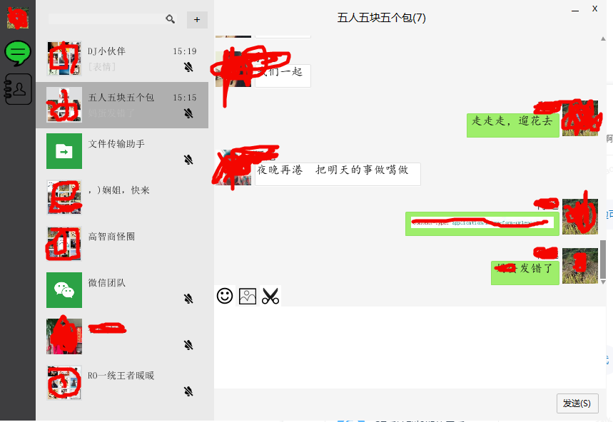

# WeChat

微信客户端 
当前支持64位操作系统，如果需要在32位操作系统上播放，请将SWT.jar替换成32位的就行了  

#技术
- [x] 界面库SWT
- [x] json解析使用jackson
- [x] dom4j解析xml
- [x] http请求使用httpclient

#功能
- [x] 同步最近聊天群，人
- [x] 发送文字
- [ ] 发送表情
- [ ] 发送图片
- [x] 显示聊天文字
- [x] 显示表情
- [x] 显示图片
- [x] 自动回复
- [x] 置顶会话
- [ ] 设置置顶

#说明
 * 数据来源：微信web版官网。
 * 部分从微信下载的表情并不能显示，微信貌似不让web客户端显示。
 * 界面自定义组件，基本上都是Canvas画出来的！
