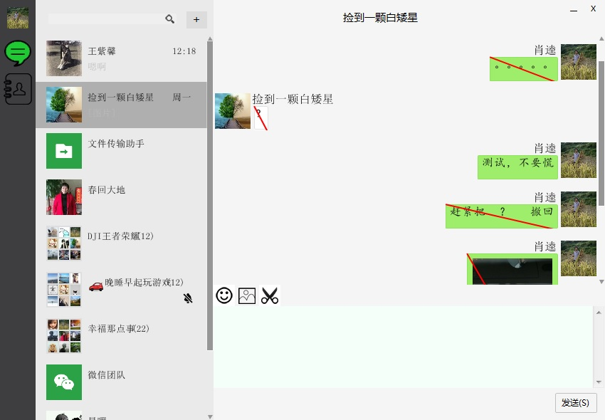

# WeChat
 
java微信客户端 
当前支持64位操作系统，如果需要在32位操作系统上使用，请将SWT.jar替换成32位的就行了  
SWT.jar与官方发版的包有一点点修改，不能直接使用官方jar,请移步https://github.com/smokingrain/WeChat/blob/master/libs/swt32.jar  
# 技术
- [x] 界面库SWT
- [x] json解析使用jackson
- [x] dom4j解析xml
- [x] http请求使用httpclient
- [x] java请使用java8及以上版本

# 功能
- [x] 同步最近聊天群，人
- [x] 桌面截图
- [x] 发送文字
- [x] 发送表情
- [x] 发送图片
- [x] 发送文件
- [x] 撤回消息
- [x] 显示聊天文字
- [x] 显示表情
- [x] 显示图片
- [x] 显示/播放视频消息
- [x] 显示/播放语音消息
- [x] 置顶会话
- [x] 设置置顶
- [x] 复制文字
- [x] 标识撤回消息
- [x] 处理添加好友

# 说明
 * 数据来源：微信web版官网。
 * 表情包数据来自https://www.52doutu.cn以及http://www.adoutu.com/
 * 部分从微信下载的表情并不能显示，微信貌似不让web客户端显示。
 * 界面自定义组件，基本上都是Canvas画出来的！
 * 欢迎联系企鹅号：348901141
 * 听说腾讯要干掉网页版微信，感觉只能往pad或者桌面版微信转了。
